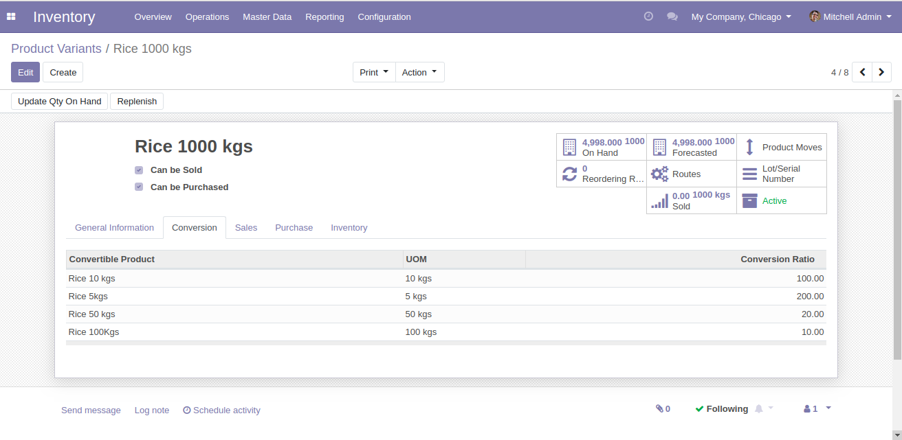
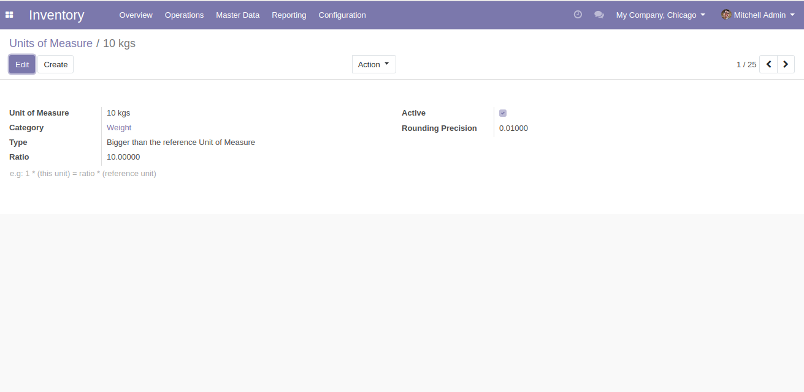
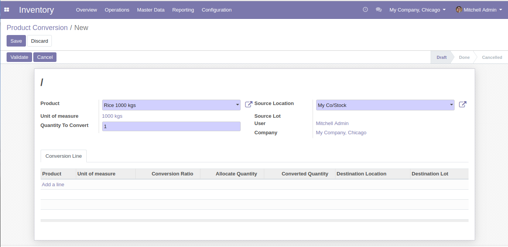
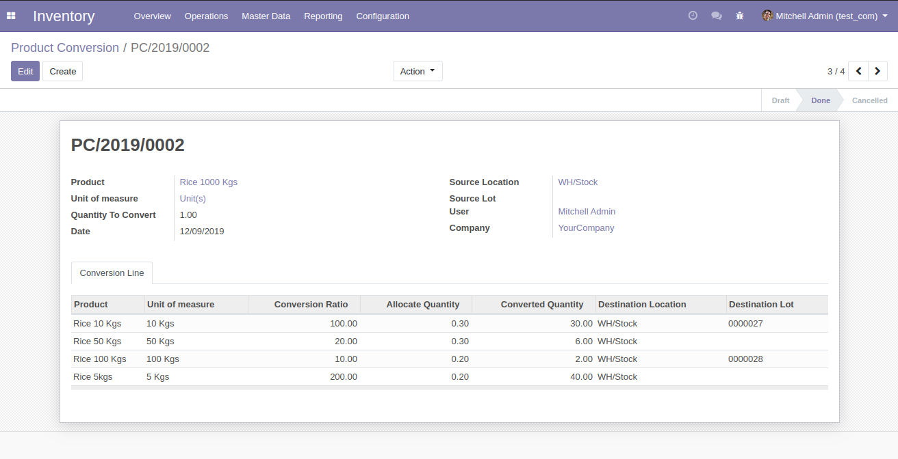

Author : FOSS INFOTECH PVT LTD

Module : product\_conversion

Version : 12.0

<h2>Product Conversion</h2>

<b>Using this application, one can convert product(s) with different Unit of Measure efficiently with a click of a button by setting a ratio of conversion for respective product(s) in the product master.</b>

<b>Step 1</b>:Go to 'Product Variants' master under 'Master Data' menu in Inventory Module--> Go to the source product that you want to convert. Under 'Conversion' tab, Tag the 'Convertible Product' , UOM will be automatically displayed and  Enter the 'Conversion Ratio'.

<b>Step 2</b>:<b>Unit of Measure Creation:</b>
                    For example, UOM name = 10kg 
                    For Type, based on <b> Reference unit of measure</b>(of parent UOM), Ratio & rounding precession is to be configured. 
                    Type = Bigger than reference Unit of Measure 
                    Ratio = 10 
                    Rounding Precision = 0.01

<b>Step 3</b>:To find the 'Product Conversion' Menu, Go to --> Inventory --> Under 'Operations' you'll find 'Product Conversion' option.

<b>Step 4</b>:Select the product that needs to be converted, Enter the source location. If lot for that product is enabled, the field 'Source Lot' will become editable.After the above step, The field 'Quantity To Convert' becomes editable, Enter the quantity that you are going to convert.

<b>Step 5</b>:Go to 'Conversion Line' Tab --> Only the convertible products tagged in the source product will appear in the drop down.Select the Product, UOM & Conversion Ratio for selected product will be fetched & displayed automatically.
Enter the quantity that you are going to allocate for the selected product.
The converted quantity will be displayed automatically.
Conversion Ratio * Allocate Quantity = Converted Quantity
Choose the destination location and lot (if Tracking as lot is enabled).

<b>Step 6</b>:To process the conversion, Click on 'validate'.
 Note: Respective stock will be reduced from Parent product, converted and reallocated to child products in the quantity required.

